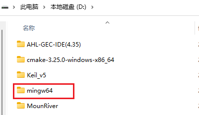
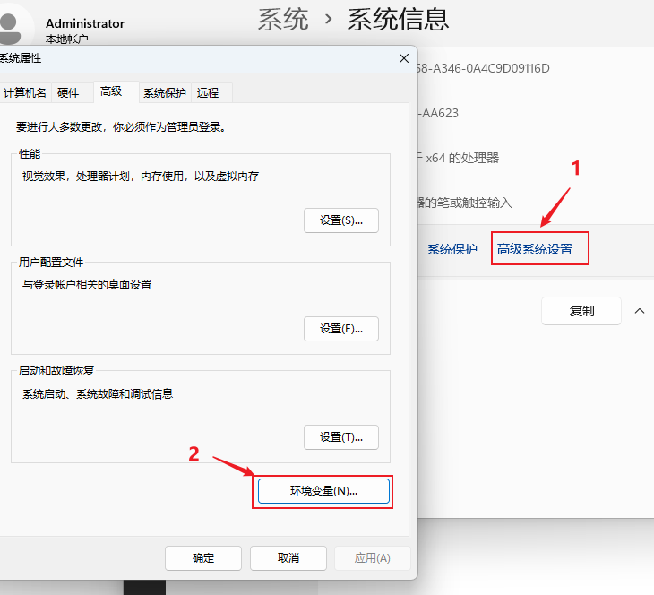

# C 语言的开发工具-编译器
## 何为编译器
   在计算机编程语言中分为两大类，一种是`编译型语言`，另一种是`解释型语言`

1. 编译型语言  
	编译型语言如C、C++、Java等，代码写完后需要通过编译器，将用户编写的文本代码，编译为计算机可执行的二进制文件后方可执行。文本代码中的语法错误在编译的时候就会被发现。

2. 解释执行型语言  
	解释执行型语言代码的运行，需要在计算机上安装有解释器，代码实在解释器的解释下，边解释便运行。文本代码中的语法错误只有在运行到的时候才会发现。

## C语言的编译器
GCC为GNU开发的编程语言编译器，它包括C、C++、Objective-C、Java和Go语言前端，也包括的这些语言的库（如stdlib.h等)。GCC的初衷是为GNU操作系统专门编写的一款编译器。

## GCC编译器Windows下安装
### 1.下载压缩包
在windows系统下使用MinGW-w64项目提供GCC编译器，我们科研通过MinGW的github页面下载最新安装包，如下图所示：

这边也可通过共享路径下：[GCC下载-TXNAS](https://txxy-nas.quickconnect.cn/d/s/rKhmASpB2QCcnF4a8AFtXGKl145BUvC3/w7323DYopL8i1UfEnlkT4TgM4NnauEKE-a7igsvkEBQo)

### 2. 解压并配置

下载后将压缩包直接解压到电脑中的某个位置，如`d:\`,目录名中最好不要包含非英文字符和空格

打开电脑的`系统属性`,在`高级系统设置`，选择`环境变量`设置页面

为电脑Path环境变量添加一个新条目，并将上面解压文件夹下的bin路径添加到条目中，如下图地址为`D:\mingw64\bin`

### 3.测试运行

可以打开windows终端（win+R，输入cmd），在终端中输入`gcc --version`,如出现一下信息提示则代表安装配置成功。

